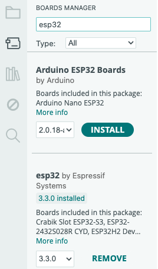
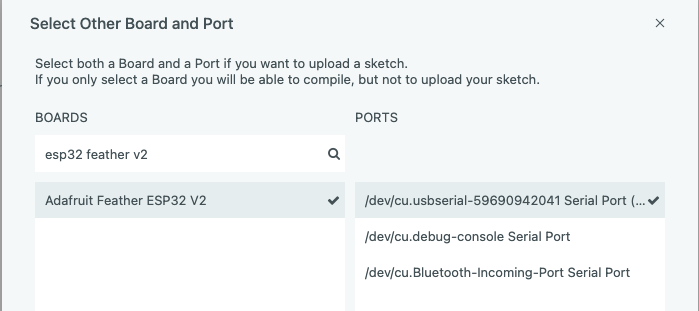
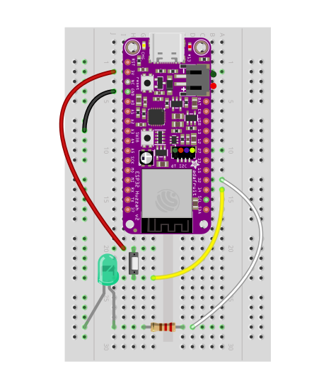

# Introductory ESP32 starter: 

### How to explore the demos

1. Open Arduino IDE
2. Locate your ESP32 in the TDF tech kit
3. Push your ESP32's pins into the breadboard in the TDF tech kit
4. Connect your ESP32's USB-C port to your computer with one of the cables provided in the kit
5. Open `01_helloworld.ino`
6. *It is assumed that you have the ESP32 board files installed, which requires two steps:*  One is that you have the ESP boards URL entered into your Arduino IDE's preferences.  To verify this, go to preferences and you'll hopefully see something like this:    
7. The other step is to install the ESP32 board files via the boards manager.  Click on the boards manager icon     ...then search for "ESP32" and install the boards.  You'll see something like this (note that we do NOT need to install the Arduino boards):   
8. Then, make sure that your ESP32 feather v2 board is selected, and that the correct port is also selected   
9. Cool!  Now you're ready to click on the "upload" icon:  

### If you get errors, note that there are a few caveats.
- there may be a transmission rate issue, in which case you should change the upload speed in [Tools] -> [Upload Speed] to 115200
- you may need to install a USB serial driver, which enables communications between your computer and the esp32.  Take a look at [this page](https://www.adafruit.com/product/5400) in the area where it talks about *"As of May 19, 2022 we have changed from using the SiLabs CP2102N to the CH9102F..."*
- you may need to install Rosetta, in which case you'll want to look at this:    

---

### Overview of objectives

1. We are building up one example over time, eventually arriving at a demo prototype that 
  - takes input from a button, 
  - processes it on the device, and
  - outputs signals via the digital pins of the microcontroller, which
  - illuminates an external LED as well as the onboard one.

2. ...the button event from your finger-press 
  - alters the periodicity of the `loop()` function that is running
  - calls a custom interrupt function, which then
  - alters the state of what is detected in the `loop()`
  - once this occurs, the rate of the `loop()`'s evaluation is updated

3. ...each time the `loop()` runs, 
  - a counter is incremented
  - the increment updates the count variable
  - a new character is chosen based on this variable
    
4. ...each time the count reaches the end of "Hello World!"
  - a secondary counter is incremented
  - the first counter is reset to 0
  - an LED flashes for a period of time

### Instructions

1. Open up the tutorial files in sequence and flash your board with them.  Study the diagram here for information about the way you will want to configure your breadboard circuit.  Take some leads out of your kit, as well as an LED, a button, and a resistor (the function of the resistor is to dim the LED, but it's not strictly necessary if you don't mind the brightness; feel free to play around with the values you have in your kit).  You'll first need to press your microcontroller into the breadboard's holes, and then copy the diagram's circuit:    

### Notes

1. In `01_helloworld`, we're mostly looking at the code and the Serial Monitor.  To get to the serial monitor, go to [Tools] -> [Serial Monitor] and you can view the output.  Note that there may be times when you don't see output and will need to close and reopen this monitor.
2. In `02_helloworld_spell`, we're incrementing a counter variable to rotate through the hello message, which allows us to use the incremented counter as a lookup into the "hello world" character array.  This captured character is then printed to the serial monitor.
3. In `03_altering_periodicity`, we use a button press to change the periodicity (speed) with which we move through the loop, which can be thought of as a clock that "ticks" each time we move through the loop.  The button press will choose a random period to update the loop with.
4. In `04_make_it_blink`, we apply a blinking process to that clock.  Each time the clock ticks, we get a blink.
5. In `05_make_it_blink_outside`, we apply that same blinking process to an external LED, as well as keeping track of a new variable in our code that increments each time the end of the "Hello World!" character array is reached.  You can view this variable's state changing in the serial monitor.

### Guidelines for activity

Feel free to reach out to a partner, a TA, or myself in class for any assistance.  Keep in mind that some or all of this may be new to you and that is totally OK!  Our goal is to assist everyone in understanding the nature of the code itself, so that we can move on to the next series of exercises.