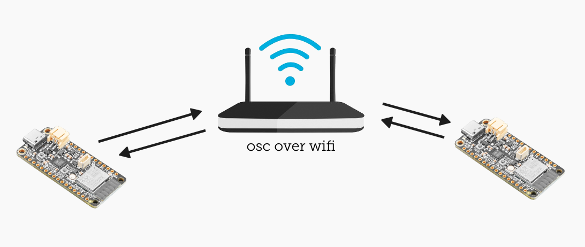

# OpenSoundControl [OSC] send/receive experiments

### OpenSoundControl is a protocol that operates over UDP

We've moved from a... 

1. single usb-c connection with our laptop, to
2. wired connections between devices (TX/RX pins), to
3. I2C connections with Stemma QT cabling,
4. and now we'll bypass further wiring to expose our ESP32 to a wireless network

---

### Introduction

The two exercises in this tutorial involve *all* prior steps in the sprint, with the addition of WiFi communications.  

OSC allows you to define your own namespace.  Rather than being subject to the ways in which data "appears" to us based on pre-existing protocols, we can define our own names for parameters that are meaningful for humans.  For example, we could define a led as `/led` and give it a `0` or a `1`.  

OSC's relevant differences:

- operates via UDP protocol of a local or wireless network.
- you can use it within applications on your machine ("localhost"), or between computers or devices on a network
- we can send data from microcontroller to microcontroller, from computer to microcontroller, etc.
- UDP usage alleviates the need to check the data
- we design what the data looks like

### Installation

\* *You will need a partner for this exercise.  One of you will be the "sender" and the other the "receiver".*

1. Open Arduino IDE
2. Expose the Library Manager by clicking on the icon:  
3. In the search field that appears, type "OSC".
4. From the results, choose "OSC by Adrian Freed"
5. Install the latest 
6. Locate your ESP32 in the TDF tech kit
7. Push your ESP32's pins into the breadboard in the TDF tech kit
8. Connect your ESP32's USB-C port to your computer with one of the cables provided in the kit.

Both sender and receiver units will need to have a few items configured, so let's get that out of the way:

1. Set up the `ssid` character array by entering the network name:  `tdf-wifi`
2. Set up the `pass` character array by entering the password (ask your prof/TA for this)
3. Set the `outPort` variable to a number between `8000` and `10000`
4. Set the `localPort` variable to a number between `8000` and `10000`.  Note that this can **not** be the same as the `outPort` number.  
5. For the sender:  Set the `outIP` variable to the desired IP Address you are *sending to*.
6. Once the unit boots (sender _or_ receiver), it will print the IP address to the serial monitor.  You may have to push [reset] on the ESP32 unit in order to get it to print by the time you have the monitor open.

---

### [Sender] esp32_osc_sendmsg

1. Open up `esp32_osc_sendmsg` in the Arduino IDE.
2. Make sure that you have carefully configured all variables as described above
3. Flash the Arduino sketch to your ESP32
4. The sender device will transmit OSC packets over the network to your desired IP and port.

### [Receiver] esp32_osc_receivemsg

1. Open up `esp32_osc_receivemsg` in the Arduino IDE.
2. Make sure that you have carefully configured all variables as described above
3. Flash the Arduino sketch to your ESP32
4. The receiver device will receive and parse OSC packets over the network *from* your desired port (note that the IP address does not matter; this is covered in the example code).
5. You will see the results in the serial monitor.  Make sure that the baud rate for the serial monitor matches your sketch's `setup()` function!

### Beyond the setup

1. Try to format the sender's data in a different way.  What is required, and how does it relate to what we have learned thus far about [data types](https://www.geeksforgeeks.org/c/data-types-in-c/) in C/C++?  What do you need to know about the OSC Arduino library in order to employ different sorts of OSC messages?
2. Try to get the receiver ESP32 to also send something back, maybe after processing the data!  What do you need to have in place, and how does it change the rules that govern the `esp_osc_receivemsg` example?

### Optional:

The sending example can also involve a program to gain *introspection*.  This involves downloading a copy of Max from Cycling '74.  This is strictly for evaluating the output via the UDP network and is not required, but allows you to do a lot of cool things in realtime whereby you can modify the data and send it out to other devices.  There are also utilities that MacOS, Windows, and Linux offer that allow you to print UDP data to a console.  

1. Download Max from [Cycling '74](https://cycling74.com/downloads)
2. Open `udp_receive_and_print.maxpat` and edit the [udpreceive] object so that it has the correct port you are sending to
3. Log your laptop onto the tdf-wifi network
4. Once you see data coming in and printing to the Max console, you are good to experiment further!
5. Contact your prof for further instructions on manipulating and operating on these data.

---

### Even Further Exploration

At this point you have many tools at your disposal to format data, incorporate sensors, yield output, and process streams.  Take this time to get creative with the exercises and make them your own.  **Document any findings in your Design journal** and have fun with it!

Here are some ideas for experiments to try:

1. Acquire sensor data in a new sketch by copying it from another `.ino` file, then package that data up to be send to another microcontroller and displayed via the onboard LED, serial port, or the included OLED in your kit
2. Acquire accelerometer xyz data in a new sketch, then use it to pass into Max/MSP and display it as a graph using the LCD object
3. Acquire data from the color sensor and use it to change the color of the neopixel LED on another esp32 device by sending it over the network
4. Acquire data from the color sensor and use it to change the color of a graphical object in Max/MSP

...the possibilities are only limited to your imagination.  A further step would be for you to move into "uncharted" territory by starting to experiment with the sensors and output devices in the kit based on the documentation found in the [TDF kit glossary](https://github.com/Berkeley-MDes/25f-desinv-202/wiki/Electronics:-Glossary).