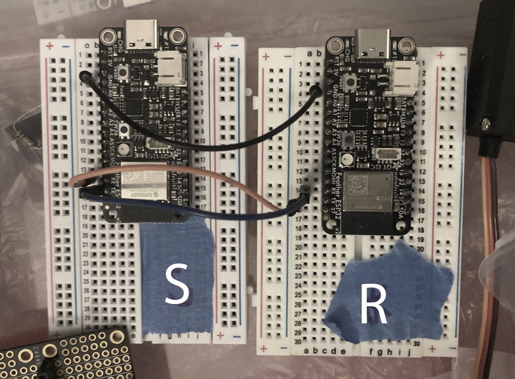
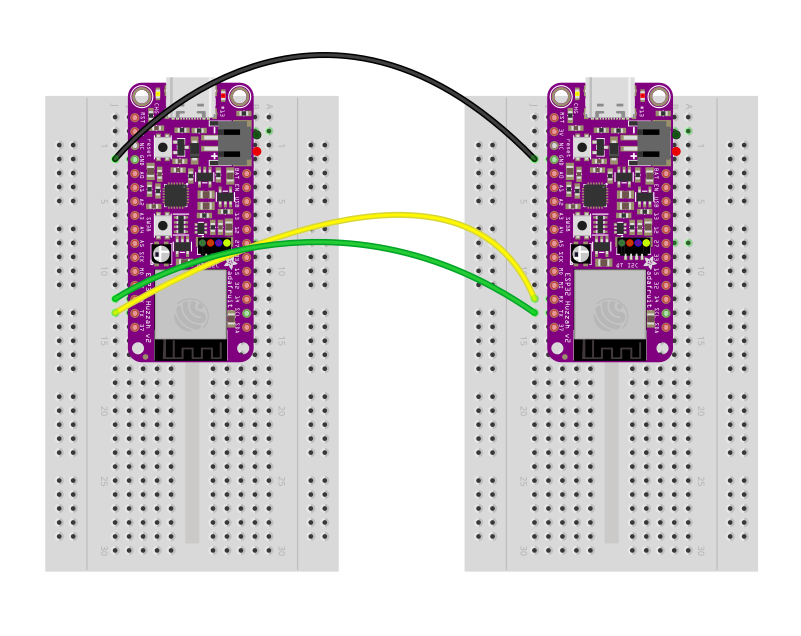
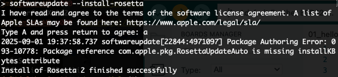

# Serial Communications: 

Serial communications can involve the asynchronous transmission of data between devices.  In this exercise, we'll learn about UART.  The nice thing about the UART protocol is that it doesn't require more than two wires as long as both devices are running at the same [baud rate](https://docs.arduino.cc/language-reference/en/functions/communication/serial/begin/).  

### Serial TX/RX transmissions

1. Open Arduino IDE
2. Locate your ESP32 in the TDF tech kit
3. Push your ESP32's pins into the breadboard in the TDF tech kit
4. Connect your ESP32's USB-C port to your computer with one of the cables provided in the kit
5. Find a partner
6. Have them do the same.  :)
7. Designate one person as the "sender" of information and the other as the "receiver".
8. The "sender" should open `ASCIITable_send.ino`
9. The "receiver" should open `ASCIITable_receive.ino`
10. Before flashing, the boards should be selected as documented in [this README](https://github.com/equilet/tdf-coursework/blob/main/sprint_readme_files/README_intro.md)
11. Also before flashing, both partners will need to wire their boards as shown in this image:     
12. Load up both INO files into respective computers and flash the boards after completing the circuit.  You'll know that the transmission is working once you are able to to monitor data in the receiver's serial monitor!

### If you get errors, note that there are a few caveats.
- there may be a transmission rate issue, in which case you should change the upload speed in [Tools] -> [Upload Speed] to 115200
- you may need to install a USB serial driver, which enables communications between your computer and the esp32.  Take a look at [this page](https://www.adafruit.com/product/5400) in the area where it talks about *"As of May 19, 2022 we have changed from using the SiLabs CP2102N to the CH9102F..."*
- you may need to install Rosetta, in which case you'll want to look at this:    

---

### Overview of objectives

1. Verify that serial data is being passed between microcontrollers
2. Evaluate printing vs writing to TX (transmit) serial pins
3. Try different datatypes and methods to format and interpret data
4. Get creative!

### Instructions

1. Once you are getting data printing in the receiver, there are a few options to consider:  What sorts of other messages can we send that are not ASCII characters?  How are those formatted, and/or represented?
2. Check out this [Serial.print()](https://docs.arduino.cc/language-reference/en/functions/communication/serial/print/) for more information
3. Take a look at using the `Serial.printf()` function and see how it differs from `Serial.print()`.  You can evaluate how to use it by learning a bit about C programming here:  https://www.geeksforgeeks.org/c/sprintf-in-c/
4. Try playing around with different baud rates between devices, as well as in the serial monitors.  What sorts of things do you notice?  Document in your journal!

### Guidelines for activity

Feel free to reach out to a partner, a TA, or myself in class for any assistance.  Keep in mind that some or all of this may be new to you and that is totally OK!  Our goal is to assist everyone in understanding the nature of the code itself, so that we can move on to the next series of exercises.