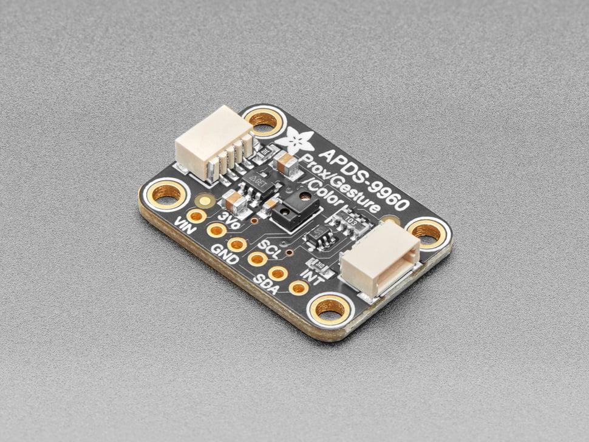
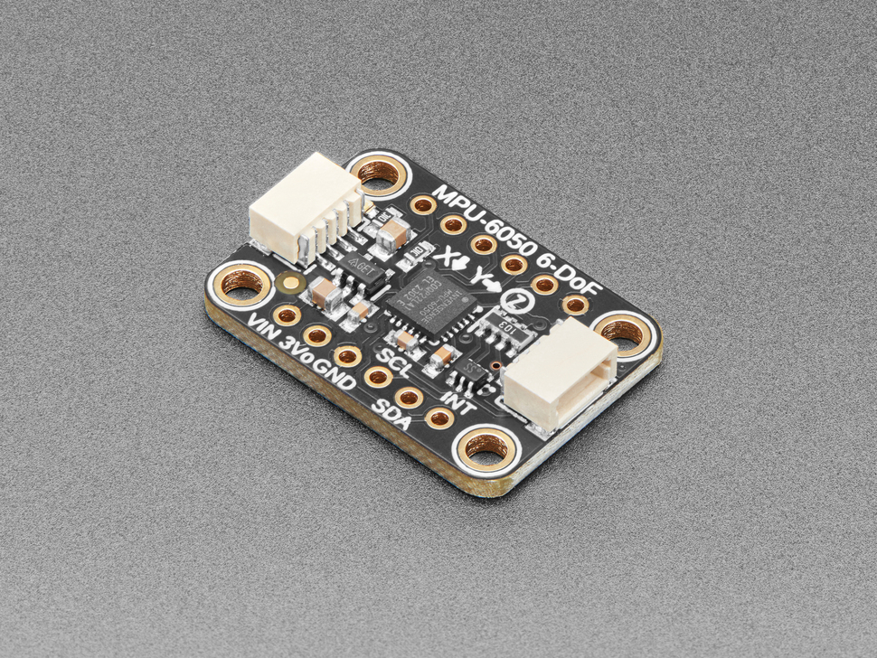

# Two sensor boards:  I2C communication 

### Physical Computing brings in the [natural world](https://en.wikipedia.org/wiki/Natural_environment)

The two exercises in this tutorial involve the [APDS-9960](https://www.adafruit.com/product/3595), and the [MPU-6050](https://www.adafruit.com/product/3886).  They are very different in functionality but have the same general footprint.  Both communicate via the [I2C](https://en.wikipedia.org/wiki/I%C2%B2C) protocol via the 4-pin Stemma QT cable provided in your kit. 

The I2C protocol is more complex than Serial with a TX/RX pair:

- 4 pins instead of 2
- synchronization (requires clock line)
- contains an independent data line
- allows for multi-master and multi-slave addressing

### Installation

1. Open Arduino IDE
2. Expose the Library Manager by clicking on the icon:  
3. In the search field that appears, type "MPU6050".
4. From the results, choose "MPU6050 by Electronic Cats"
5. Install the latest 
6. In the search field, type "SparkFun APDS9960" *(...RGB and Gesture Sensor Arduino Library)*
7. Install the latest
8. In the search field, type "Adafruit APDS9960 Library" by Adafruit
9. Install the latest
10. Locate your ESP32 in the TDF tech kit
11. Push your ESP32's pins into the breadboard in the TDF tech kit
12. Connect one of the sensor boards via the [4-pin Stemma QT cable](https://www.adafruit.com/product/4399) to the Stemma port on your ESP32 *
13. Connect your ESP32's USB-C port to your computer with one of the cables provided in the kit. *

\* *Be mindful of the orientation!  The Stemma QT cable has a side with pins and a slot that helps guide it into the port.  Be careful **not** to force the connector in the wrong way!*

---

### APDS-9960

The APDS-9960 offers a selection of sensors on a single board.  The extra complexity requires a bit more consideration in the firmware code.  The sensors provided are:

- proximity *(distance within around 6in)*
- color *(color temperature or color-matching)*
- ambient light *(light intensity)*
- gesture *(up/down/left/right; also raw data)*

#### APDS-9960: Run the proximity/color examples

These two examples use the SparkFun library, which is a bit easier to grok.  Feel free to simply bring up the prox/color examples from the Adafruit install you did earlier. 

1. Open up `apds_9960_color`, or `apds_9960_prox` in the Arduino IDE.
2. Select your ESP32 board and associated port
3. Check relevant configuration data (for example, we found that the upload speed sometimes needs to be reset to 115200)
4. Flash your ESP32 with the relevant example to test
5. The color example will print out automatically, and the proximity requires you to move your hand closer/further from the señor.  The range of activity is about 12" max from the sensor board itself
6. Evaluate the sensor data in the Serial monitor (make sure to match the baud rate in the serial monitor with the one in the sketch)

#### APDS-9960: Run the gesture example

This example uses the Adafruit Library, which avoids the need for the interrupt pin usage on the sensor board.

1. Open up `apds_9960_gesture` in the Arduino IDE.
2. Select your ESP32 board and associated port
3. Check relevant configuration data as above
4. Flash your ESP32
5. Wave your hand closely to the sensor board in the up, down, left, right directions
6. Evaluate the sensor data in the Serial monitor (make sure to match the baud rate in the serial monitor with the one in the sketch)

**\* Note:** *each sensor type on the board requires a slightly different approach with loop() and setup() in the `.ino` sketch*

---

### MPU-6050

The MPU-6050 is a 6-degree-of-freedom accelerometer with a built-in gyroscope.  The gyroscope senses how fast the board is moving around, and the accelerometer yields orientation in 3 axes.  It measures gravity, so it knows which direction is downward.

#### MPU-6050: Steps to run the example

1. Open up `mpu_6050_accgyro` in the Arduino IDE.
2. Select your ESP32 board and associated port
3. Check relevant configuration data (for example, we found that the upload speed sometimes needs to be reset to 115200)
4. Flash your ESP32 with the example to test
5. Open up Serial Monitor and set to 38400 baud
6. Evaluate the sensor data in the Serial monitor

**\* Note:** *as you move the sensor and/or breadboard you're testing with, you get differing values for [pitch, roll, and yaw](https://en.wikipedia.org/wiki/Euler_angles).  There is "raw" and "cooked" data, meaning that the raw values are straight off the board, where as the cooked values have been prepared to be more user-friendly.  The gyro data represents the rate of change in a given accelerometer axis.*

---

### Objectives

1. Acquire sensor data in a variety of formats
2. Incorporate earlier lessons regarding data formatting and transmission
3. Learn about various models of computation as they apply to different sensor technologies
4. Acquire a new source of data from the natural world for your projects

### Instructions

1. After testing the examples with your board, speculate on how you might access these data from the sensor boards in another sketch you've been working on
2. Experiment with updating the baud rate for the example sketches and associate that setting with the Serial monitor
3. Document in your journal
4. Incorporate the acquisition of the sensor data into another Arduino sketch
5. Document in your journal